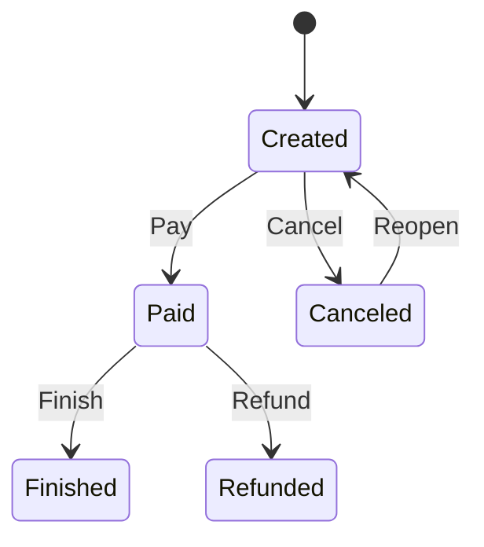

# 🏨 HotelBooking

A hotel reservation system built with **.NET 6**, designed around **Domain-Driven Design (DDD)**, **Hexagonal Architecture (Ports & Adapters)**, **Clean Architecture**, **SOLID** principles and **Test-Driven Development (TDD)**.

> 🚧 **Work in progress** — the domain model (guests, rooms and bookings) is in place, and the guest registration flow is implemented end to end through the API.

---

## ✨ Features

- **Guest registration and lookup** via a REST API, with domain validation:
  - document number and type (Passport / Driver's License)
  - required fields (name, surname, e-mail)
  - e-mail format
- **Booking state machine** that controls the booking lifecycle (create, pay, cancel, finish, refund, reopen).
- **Value Objects** for `PersonId` (document) and `Price` (value + currency: Dollar / Real).
- **Standardized responses** with `Success`, `Message` and `ErrorCode` returned by the application layer.
- **Swagger / OpenAPI** in the development environment.
- **Docker** image and **Azure DevOps** pipeline that builds and pushes it to Azure Container Registry.

## 🛠️ Tech Stack

| Area | Technology |
|---|---|
| Runtime | .NET 6 / ASP.NET Core Web API |
| ORM | Entity Framework Core 7 (Code First + Migrations) |
| Database | SQL Server |
| Tests | xUnit, Moq, coverlet |
| API docs | Swashbuckle (Swagger) |
| DevOps | Docker, Azure DevOps Pipelines, Azure Container Registry, Azure Key Vault |

## 🧱 Architecture

The solution follows the hexagonal architecture: the **Core** (Domain + Application) has no dependency on infrastructure, it exposes **ports** (interfaces), and the outer layers provide the **adapters**.

```
BookingService/
├── Core/
│   ├── Domain/            # Entities, Value Objects, Enums, domain exceptions and ports
│   │   ├── Entities/      # Guest, Room, Booking
│   │   ├── ValueObjects/  # PersonId, Price
│   │   ├── Enums/         # Status, Action, DocumentType, AcceptedCurrencies
│   │   ├── Exceptions/    # InvalidEmail, InvalidPersonDocumentId, MissingRequiredInformation
│   │   └── Ports/         # IGuestRepository
│   └── Application/       # Use cases (GuestManager), DTOs, requests/responses, ports
├── Adapters/
│   └── Data/              # EF Core: HotelDbContext, repositories, configurations, migrations
├── Consumers/
│   └── API/               # ASP.NET Core Web API (driving adapter)
└── Tests/
    ├── Domain/            # Domain tests (booking state machine)
    ├── Application/       # Use case tests with Moq (GuestManager)
    └── Adapters/          # Adapter tests (placeholder)
```

**Dependency flow:** `API → Application → Domain ← Data`

### Booking lifecycle



Any transition not listed keeps the booking in its current status.

## 🔌 API Endpoints

| Method | Route | Description |
|---|---|---|
| `POST` | `/Guest` | Registers a new guest |
| `GET` | `/Guest?id={id}` | Gets a guest by id |

**Request example — `POST /Guest`**

```json
{
  "name": "John",
  "surname": "Doe",
  "email": "john.doe@email.com",
  "idNumber": "AB123456",
  "idTypeCode": 1
}
```

`idTypeCode`: `1` = Passport, `2` = Driver's License.

**Error codes**

| Code | Meaning |
|---|---|
| `1` | NOT_FOUND |
| `2` | COULD_NOT_STORE_DATA |
| `3` | INVALID_PERSON_ID |
| `4` | MISSING_REQUIRED_INFORMATION |
| `5` | INVALID_EMAIL |
| `6` | GUEST_NOT_FOUND |

## 🚀 Getting Started

### Prerequisites

- [.NET 6 SDK](https://dotnet.microsoft.com/download/dotnet/6.0)
- SQL Server (Express, LocalDB or a container)
- EF Core CLI: `dotnet tool install --global dotnet-ef`

### Steps

1. **Clone the repository**

   ```bash
   git clone https://github.com/Roger8973/HotelBooking.git
   cd HotelBooking
   ```

2. **Set the connection string.** In `appsettings.json` the `Main` connection string is the token `#{databaseconnection}#`, which the pipeline replaces with a secret from Azure Key Vault. For local development, set it in `BookingService/Consumers/API/appsettings.Development.json` or via user secrets:

   ```json
   "ConnectionStrings": {
     "Main": "Server=(localdb)\\mssqllocaldb;Database=HotelBooking;Trusted_Connection=True;"
   }
   ```

3. **Apply the migrations**

   ```bash
   dotnet ef database update --project BookingService/Adapters/Data --startup-project BookingService/Consumers/API
   ```

4. **Run the API**

   ```bash
   dotnet run --project BookingService/Consumers/API
   ```

   Swagger will be available at `https://localhost:7175/swagger`.

### Running with Docker

```bash
docker build -t hotelbooking .
docker run -p 8080:80 -e ConnectionStrings__Main="<your-connection-string>" hotelbooking
```

## 🧪 Tests

```bash
dotnet test
```

- **DomainTests** — booking state machine rules.
- **ApplicationTests** — `GuestManager` use cases (happy path, invalid document, missing information, invalid e-mail, guest not found), with the repository mocked via Moq.

## ⚙️ CI/CD

The `azure-pipelines.yml` pipeline runs on every push to `master` and:

1. Loads secrets from **Azure Key Vault**;
2. Replaces the tokens in `appsettings.json` (`replacetokens`);
3. Builds the Docker image and pushes it to **Azure Container Registry** with the build id and `latest` tags.

## 📌 Roadmap

- [ ] Booking and room use cases and endpoints
- [ ] Room availability (`HasGuest` is currently hard-coded)
- [ ] Guest update
- [ ] CQRS with Mediator (MediatR)
- [ ] Payment integration
- [ ] More state machine tests and adapter tests
- [ ] Run tests in the CI pipeline
- [ ] Upgrade to .NET 8 (LTS) — .NET 6 is out of support

## 👤 Author

**Roger Fraga Messina** — [GitHub](https://github.com/Roger8973)
